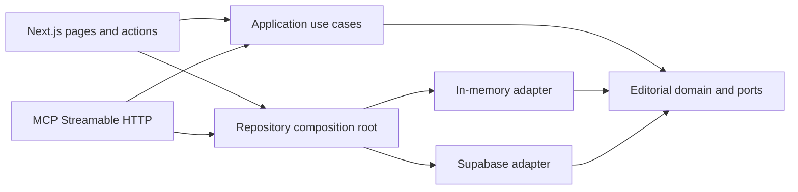

# Architecture

NEURA uses a small hexagonal architecture: business rules point inward, delivery and storage concerns stay at the edges, and composition happens in one infrastructure boundary.

## Dependency rule

The domain must not import Next.js, React, Supabase, browser APIs, or transport types. Adapters implement domain ports; the composition root selects an adapter from validated environment state.

## Layers

| Layer | Location | Responsibility |
| --- | --- | --- |
| Domain | `src/modules/editorial/domain` | Article/category types, publication states, slug and reading-time rules, repository ports |
| Application | `src/modules/editorial/application` | Feed/query orchestration and cache policy |
| Inbound adapters | `src/app`, `src/modules/mcp` | HTML, Server Actions, JSON-RPC, localization, HTTP policy |
| Outbound adapters | `src/modules/editorial/infrastructure` | In-memory demo and Supabase persistence |
| Composition | `src/modules/editorial/infrastructure/container.ts` | Selects demo or Supabase without leaking adapter details |
| Database | `supabase/migrations` | Constraints, indexes, RLS, grants, triggers, full-text vectors |

## Main flows

### Public read

1. A locale-prefixed Next.js route validates `en` or `it`.
2. The application query asks the `ArticleRepository` port for published content.
3. The composition root selects the memory or Supabase adapter.
4. Public pages return Server Component HTML; cached feed/article queries use explicit revalidation windows.
5. Archive pages render their first slice in HTML, then the web delivery adapter requests compact list items with the same opaque composite cursor used by MCP.

### Editorial write

1. The authenticated studio submits a Server Action.
2. Input is parsed at the delivery boundary.
3. The action rechecks the Auth user and editor profile; page/proxy checks are not trusted as authorization.
4. The repository writes through Supabase and RLS evaluates the mutation again.
5. Affected localized public and studio paths are revalidated.

### MCP read

1. `/api/mcp` accepts Streamable HTTP JSON-RPC.
2. Zod schemas validate tool arguments at the transport boundary.
3. Tools depend on the same read-only editorial port as the site.
4. Only published records are serialized into explicit output schemas.

### MCP editorial write

1. `/api/mcp/admin` verifies a high-entropy Bearer key before parsing or composing persistence.
2. Zod schemas validate explicit create, patch, publish, and delete tool inputs.
3. The server-only Supabase client uses a service-role key and a configured editor author ID; neither reaches the browser.
4. Public MCP remains a different read-only adapter and cannot acquire mutation tools accidentally.

## Domain invariants

- `locale` is explicit on every category and article.
- `translation_key` links language variants; it is not a public slug.
- Slugs are unique per locale and remain locale-specific.
- A published article requires `published_at`; a scheduled article requires `scheduled_for`.
- Article/category foreign keys preserve locale consistency.
- Search vectors use English or Italian dictionaries according to the row locale.
- Social publication state records intent/status; outbound network posting is a separate authorized operation.
- Newsletter emails are normalized and unique. Anonymous writes pass through a security-definer RPC that validates input, returns a uniform result, and leaves the table without a direct anonymous insert policy.

## Adapter selection

Both `NEXT_PUBLIC_SUPABASE_URL` and `NEXT_PUBLIC_SUPABASE_ANON_KEY` must be non-empty. If either is absent, public delivery uses the deterministic memory adapter. Studio uses that writable adapter only outside production or when `NEURA_ENABLE_DEMO_STUDIO=true` is explicitly set; otherwise its identity and composition boundaries fail closed. Production smoke checks must confirm the Supabase-backed content expected for that environment.

## Design principles

- **KISS:** two persistence adapters, one port, one composition root.
- **DRY:** site and MCP share editorial queries, cursor encoding, and serialization-ready domain objects.
- **SOLID:** delivery depends on ports; adapters are substitutable; interfaces stay use-case sized.
- **Fail visibly:** malformed input and unavailable data become bounded errors; no silent cross-locale content fallback.
- **Least privilege:** the browser receives only the anon/publishable key; the service-role key is isolated to the authenticated admin MCP route, while Studio continues to rely on RLS and SQL grants.

## Change checklist

When adding a capability:

1. Add a domain rule only if it is transport- and database-independent.
2. Extend the smallest relevant port.
3. Implement memory and Supabase adapters together.
4. Add one application use case, then thin delivery adapters.
5. Put input and output validation at each external boundary.
6. Add a migration for persistent invariants and indexes.
7. Prove the changed path in demo and Supabase modes when persistence behavior changes.
